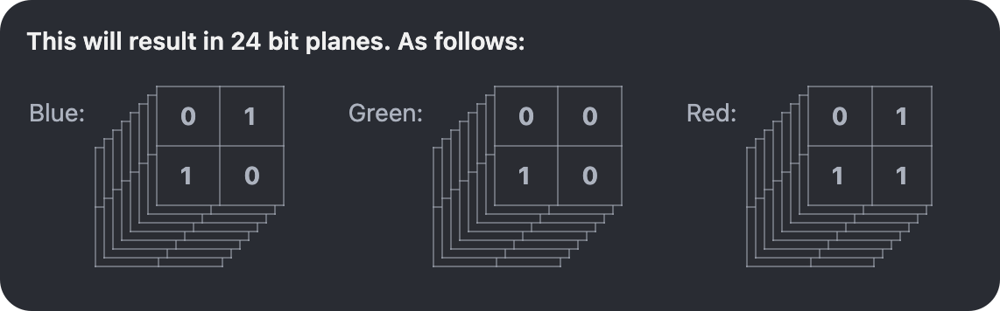
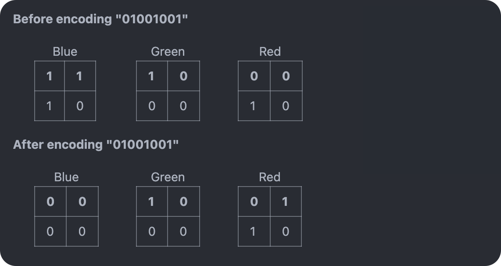

## Introduction
---

What is steganography? Steganography is the act of concealing an article, such as a message, image, or file within another message. This repository embarks on a step by step process demonstrating how you would go about implementing LSB stegonagraphy which is a specific variation of steganography that takes advantage of the fact that the least significant bits of the pixel values in an image can be altered without affecting the visual appearance of that image.


## Demonstration
--- 
Consider the following image: 
    

The above image has not been tampered with in any way. 

Now consider the following image: 
    

The above image contains the source code of our program.

Can you spot the difference? 

### Running the program:
Modules used:
```
python-opencv 
```

Usage statement: 
```
Usage: python3 lsb_steg.py [<mode> input_image] [-i input_file] [-o output_image] 

Modes:
    -h      Help mode. This mode does not take any arugments
    -m      Mapout mode. Calculates the 
    -e      Encode mode. Encodes input_file into the input_image
    -d      Decode mode. Decodes the stegged image to retreive secret message

Examples: 
    python3 lsb_steg.py -m input_image.png
    python3 lsb_steg.py -e input_image.png -i input_file.txt
    python3 lsb_steg.py -e input_image.jpg -i input_file.txt -o output_image.png
    python3 lsb_steg.py -d input_image.png 

Notes: 
    Currently, this program can only embed ascii characters into input_image. 
```

## In-Depth Implementation Analysis
---
### Background
**What is LSB and why is it relevant?**\
In PBC (Pure-Binary Coding) a byte is a set of 8 bits that each have a value of 2^n, where n is the position. You start from the right most position of 0. So for example

```
10001000
```
Has a value of 136, because 2^3 = 8 and 2^7 = 128 => 8 + 128

LSB Steganography consists of taking advantage of the fact that the least significant bit of a binary representation of a value has a minimal value, which can be used to encode a message.

### Encoding
1. Let's take a 2x2 rgb pixel image (which is far too small to truly be considered an image but only aims to present the idea), and try to encode the message "I" within it.

2. We first start by converting "I" to it's ascii representation of 73, and then getting the binary representation of that characters value, which is 
    ```
    01001001 
    ```

    Note: It should be worth noting that the initial padded zeros are not ommitted since this can be problematic when trying to decode the message later which would entail interpretting every 8 bits as an ascii character. Additionally it should be worth noting that we also store the length of the encoded msg in front of the message for when we go to extract the message.

3. From here you we take the image and convert it into an array. In this case it will be a 3d array of size 2x2x3 because it's a rgb image. 

    Note: Had our implementation been geared toward a greyscale implementation, this would only be a 2d array of 2x2. But since our implementation has color channels, it will proide a 12 pixel vessel (i.e. 2x2x3 vessel) with an encoding space of 12 bits. The reason it's only 12 bits is because only the LSB is available for encoding.

4. Once we have our 2x2x3 array, we want to split it into 3 independent 2d arrays (1 array for each channel, r, g, b) and split those arrays into 8 bit planes, where each plane is 2x2 (height x width) and represents 1 bit of the specified channel's color value.


    

<!-- Styling Start: IGNORE -->
<!-- <style>
.tables-container {
    display: flex;
    padding-top: 1%;
    padding-left: 5%;
}
.table-container {
    position: relative;
    width: 150px;
    height: 120px;
}

.o-table {
    position: absolute;
    border-collapse: collapse;
    z-index: 1;
}

.o-table th, .o-table td {
    background: #292C33;
    border: 1px solid black;
    font-weight: bold;
}
</style> -->
<!-- Styling End: IGNORE -->

<!-- Tables Start: IGNORE -->
<!-- <div class="tables-container">
    <span>Blue:</span>
    <div class="table-container">
        <table class="o-table" style="bottom: 5px; left: 5px;"><tr><th>0</th><th>0</th></tr><tr><td>0</td><td>0</td></tr></table>
        <table class="o-table" style="bottom: 10px; left: 10px;"><tr><th>0</th><th>0</th></tr><tr><td>0</td><td>0</td></tr></table>
        <table class="o-table" style="bottom: 15px; left: 15px;"><tr><th>0</th><th>0</th></tr><tr><td>0</td><td>0</td></tr></table>
        <table class="o-table" style="bottom: 20px; left: 20px;"><tr><th>0</th><th>0</th></tr><tr><td>0</td><td>0</td></tr></table>
        <table class="o-table" style="bottom: 25px; left: 25px;"><tr><th>0</th><th>0</th></tr><tr><td>0</td><td>0</td></tr></table>
        <table class="o-table" style="bottom: 30px; left: 30px;"><tr><th>0</th><th>0</th></tr><tr><td>0</td><td>0</td></tr></table>
        <table class="o-table" style="bottom: 35px; left: 35px;"><tr><th>0</th><th>0</th></tr><tr><td>0</td><td>0</td></tr></table>
        <table class="o-table" style="bottom: 40px; left: 40px;"><tr><th>0</th><th>1</th></tr><tr><td>1</td><td>0</td></tr></table>
    </div>
    <span>Green:</span>
    <div class="table-container">
        <table class="o-table" style="bottom: 5px; left: 5px;"><tr><th>0</th><th>1</th></tr><tr><td>1</td><td>0</td></tr></table>
        <table class="o-table" style="bottom: 10px; left: 10px;"><tr><th>0</th><th>0</th></tr><tr><td>0</td><td>0</td></tr></table>
        <table class="o-table" style="bottom: 15px; left: 15px;"><tr><th>0</th><th>0</th></tr><tr><td>0</td><td>0</td></tr></table>
        <table class="o-table" style="bottom: 20px; left: 20px;"><tr><th>0</th><th>0</th></tr><tr><td>0</td><td>0</td></tr></table>
        <table class="o-table" style="bottom: 25px; left: 25px;"><tr><th>0</th><th>0</th></tr><tr><td>0</td><td>0</td></tr></table>
        <table class="o-table" style="bottom: 30px; left: 30px;"><tr><th>0</th><th>0</th></tr><tr><td>0</td><td>0</td></tr></table>
        <table class="o-table" style="bottom: 35px; left: 35px;"><tr><th>0</th><th>0</th></tr><tr><td>0</td><td>0</td></tr></table>
        <table class="o-table" style="bottom: 40px; left: 40px;"><tr><th>0</th><th>0</th></tr><tr><td>1</td><td>0</td></tr></table>
    </div>
    <span>Red:</span>
    <div class="table-container">
        <table class="o-table" style="bottom: 5px; left: 5px;"><tr><th>0</th><th>0</th></tr><tr><td>0</td><td>0</td></tr></table>
        <table class="o-table" style="bottom: 10px; left: 10px;"><tr><th>0</th><th>0</th></tr><tr><td>0</td><td>0</td></tr></table>
        <table class="o-table" style="bottom: 15px; left: 15px;"><tr><th>0</th><th>0</th></tr><tr><td>0</td><td>0</td></tr></table>
        <table class="o-table" style="bottom: 20px; left: 20px;"><tr><th>0</th><th>0</th></tr><tr><td>0</td><td>0</td></tr></table>
        <table class="o-table" style="bottom: 25px; left: 25px;"><tr><th>0</th><th>0</th></tr><tr><td>0</td><td>0</td></tr></table>
        <table class="o-table" style="bottom: 30px; left: 30px;"><tr><th>0</th><th>0</th></tr><tr><td>0</td><td>0</td></tr></table>
        <table class="o-table" style="bottom: 35px; left: 35px;"><tr><th>0</th><th>0</th></tr><tr><td>0</td><td>0</td></tr></table>
        <table class="o-table" style="bottom: 40px; left: 40px;"><tr><th>0</th><th>1</th></tr><tr><td>1</td><td>1</td></tr></table>
    </div>
</div> -->
<!-- Tables End: IGNORE -->

5. Once we have these bit planes we encode our length concatonated with our message into the bits of the bottom-most plane (since this is where the LSB of each channel resides). To be more precise: we start at the top left corner of the bottom-most plane and cycle through the bits of all three channels (one bit at a time), ensuring that each bit of the message is distributed evenly across all three channels during the encoding process.

    

<!-- <span style="font-weight: bold">&emsp;&emsp;Before encoding "01001001"</span>
<div style="display: flex; padding-left: calc(2% + 40px); width: 400px;">
    <table><caption>Blue</caption><tr><th>1</th><th>1</th></tr><tr><td>1</td><td>0</td></tr></table>
    <table><caption>Green</caption><tr><th>1</th><th>0</th></tr><tr><td>0</td><td>0</td></tr></table>
    <table><caption>Red</caption><tr><th>0</th><th>0</th></tr><tr><td>1</td><td>0</td></tr></table>
</div>

<span style="font-weight: bold">&emsp;&emsp;After encoding "01001001"</span>
<div style="display: flex; padding-left: calc(2% + 40px); width: 400px;">
    <table><caption>Blue</caption><tr><th>0</th><th>0</th></tr><tr><td>0</td><td>0</td></tr></table>
    <table><caption>Green</caption><tr><th>1</th><th>0</th></tr><tr><td>0</td><td>0</td></tr></table>
    <table><caption>Red</caption><tr><th>0</th><th>1</th></tr><tr><td>1</td><td>0</td></tr></table>
</div> -->

6. Additionally as mentioned earlier, the length of the encoded string is prepended at the start of the encoding process alonsgide the message, for demonstrative purposes we didn't include it in our encoding example, but the overall process is the same.

7. Once the length and message have been encoded into the bottom-most plane of the channels (LSB), the bit planes are merged back into a singular plane for each channel (b, g, r). From here the channels are then merged back together to make a singular colored image.

8. Finally the message has been fully hidden within the image, and it's ready to be shared.

### Decoding
1. Let's look back at that 2x2 rgb image from earlier. We went about decoding the image in a pretty similar fashion to encoding it.

3. Similar to encoding, we take an image and convert it into a 3d array in this case of size 2x2x3 

4. Once we have our 3d array, we split it into 3 independent 2d arrays (1 array for each channel, r, g, b) and split those arrays into 8 bit planes, where, in this case, each plane is 2x2 (height x width) and represents 1 bit of the specified channel's color value.

5. From here we first extract the message length which is found by cycling through each channel's bottom-most bit plane. Once we've extracted our length.

6. Once we've extracted our length we then use that to once again continue the cycle, while extracting the 8 bit chunks, converting them to their ascii representations, and appending them to a list of characters until until the end of the message.

6. Once we've extracted the full message, we join our list of characters and feed the full message to stdout.

### Capacity
We calculate the capacity for the image very naively. We take the product of the pixel height, width, and available channels of the input image, and then divide it by 8 (to convert the total number of bits to bytes). This gives us an estimate of how much text can be hidden in the image. 

Overall this measurement is reasonable, but it does not account for factors that can affect capacity, such as the actual content of the image, and the presence of informative vs noisy . Accounting for these factors in the calculation and encoding may help to minimize areas that may be more susceptible to distortion from overloading the image's least significant bits.

### Image Compressions and Data Loss
Different image files have different compression algorithms. However, there are two general categories of compressions: lossless and lossy compression. Image files like png support lossless compression. In a lossless compression, no data is lost upon compressing the image. In other words, we can encode some arbitrary data into the image and expect it to be retained through the compression algorithm. Thus, image files that supports lossless compression are suitable for digital steganography. In contrast, image files like jpg support lossy compression, where some data is lost upon compression. Thus, image files that only supports lossy compressions are not suitable for digital steganography. 

## Final Thoughts on Steganography:
---

LSB steganography is reasonable to implement and certainly has its interesting features, but it has its caveats. For one, it's pretty easy to decode once you know what algorithm was used to hide the message. Additionally, there's the limitation of only being able to hide data in the LSB of the image, because you may distort the image if you try to alter any of the more significant bits of the image. Nevertheless, it certainly remains impressive, and shows one of many innovative strategies available for concealing information.
